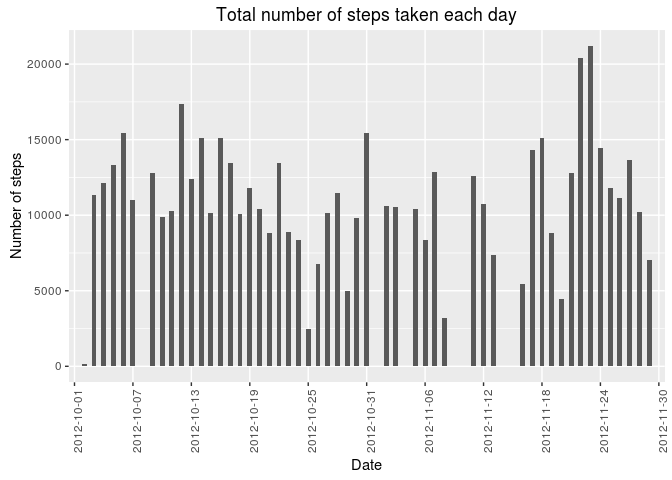
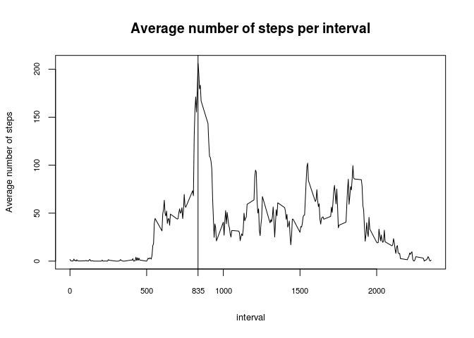
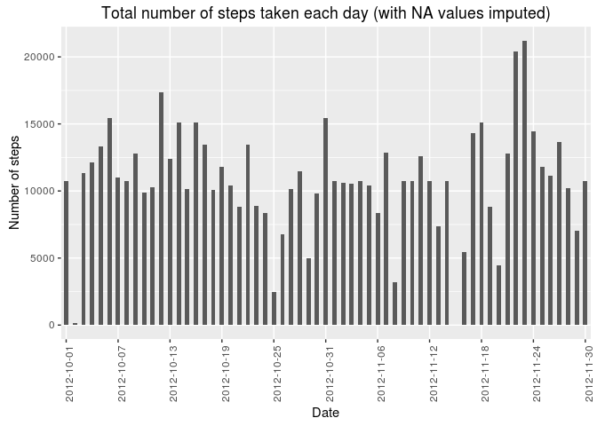
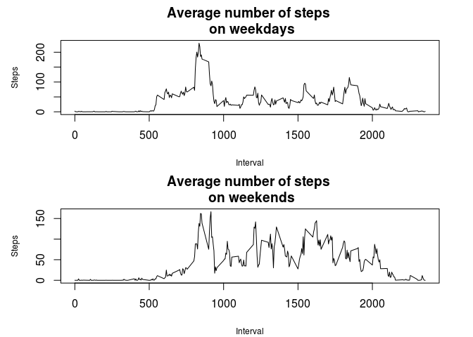

# Reproducible Research: Course Project 1
Mykola Klymenko  
15 May 2016  
##Intro

This document is focused on researching the data from a personal activity monitoring device.
This device collects data at 5 minute intervals through out the day. The data consists of two months of data from an anonymous individual collected during the months of October and November, 2012 and include the number of steps taken in 5 minute intervals each day.

The data for this assignment can be downloaded from the course web site:

Dataset:  [Activity monitoring data](https://d396qusza40orc.cloudfront.net/repdata%2Fdata%2Factivity.zip) [52K]

The variables included in this dataset are:

*steps*: Number of steps taking in a 5-minute interval (missing values are coded as NA)  
*date*: The date on which the measurement was taken in YYYY-MM-DD format  
*interval*: Identifier for the 5-minute interval in which measurement was taken  

The dataset is stored in a comma-separated-value (CSV) file and there are a total of 17,568 observations in this dataset.  

**Loading and preprocessing the data**

```r
Url <- 'https://d396qusza40orc.cloudfront.net/repdata%2Fdata%2Factivity.zip'
dataDir <- './data'
zipFile <- './data/Data.zip'

# Data folder creation
if (!file.exists(dataDir)) {
  dir.create(dataDir)
}
  
# File download
if (!file.exists(zipFile)) {
  download.file(url = Url, destfile = zipFile)
  unzip(zipFile, exdir = dataDir)
}
dataFile <- unzip(zipFile, list = TRUE)$Name
# Data input
input <- read.csv(file.path(dataDir, dataFile))
```


```r
library(dplyr)
library(ggplot2)
```
##1. What is mean total number of steps taken per day?

```r
# Calculate the total number of steps taken per day
input_byDay <- group_by(input, date)
input_sum_byDay <- summarise(input_byDay, sum.step = sum(steps))

# Make a histogram of the total number of steps taken each day
ticks <- seq(as.Date(input_sum_byDay$date[1]), 
             as.Date(input_sum_byDay$date[length(input_sum_byDay$date)]), 
             by = 6)

p <- ggplot(data = input_sum_byDay) + 
  stat_count(aes(x = date, weights = sum.step), width = 0.5) +
  ylab('Number of steps') + 
  ggtitle('Total number of steps taken each day') +
  scale_x_discrete('Date', breaks = as.factor(ticks), labels = waiver()) +
  theme(axis.text.x = element_text(angle = 90))
p
```

<!-- -->

```r
# Calculate and report the mean and median of the total number 
# of steps taken per day
mean_total_per_day <- summary(input_sum_byDay$sum.step)['Mean']
median_total_per_day <- summary(input_sum_byDay$sum.step)['Median']
print(c('Mean of total steps per day: ', as.character(mean_total_per_day), 
      'Median of total steps per day: ', as.character(median_total_per_day)))
```

```
## [1] "Mean of total steps per day: "   "10770"                          
## [3] "Median of total steps per day: " "10760"
```

##2. What is the average daily activity pattern?

```r
# Make a time series plot (i.e. type = "l") of the 5-minute interval (x-axis) 
# and the average number of steps taken, averaged across all days (y-axis)
# Which 5-minute interval, on average across all the days in the dataset, 
# contains the maximum number of steps?
input_byInterval <- group_by(input, interval)
input_mean_byInterval <- summarise(input_byInterval, mean.step = mean(steps, na.rm = TRUE))
plot1D <- input_mean_byInterval
max_av_int <- input_mean_byInterval[which.max(input_mean_byInterval$mean.step),]$interval

plot(plot1D$interval, plot1D$mean.step, type = "l", lwd = 1,
     xlab = 'interval', ylab = 'Average number of steps',
     main = 'Average number of steps per interval',
     cex.lab = 0.8, cex.axis = 0.7)
abline(v = max_av_int)
axis(side = 1, at = max_av_int, cex.axis = 0.7)
```

<!-- -->

As we can see, the maximum amount of steps on average was performed during the interval of 8:35am, which may correspond with going-to-work time.

##3. Imputing missing values

```r
# Note that there are a number of days/intervals where there are missing values 
# (coded as NA). The presence of missing days may introduce bias into 
# some calculations or summaries of the data.
#
# Calculate and report the total number of missing values in the dataset 
# (i.e. the total number of rows with NAs)
total_NA <- summary(input$steps)["NA's"]

# Devise a strategy for filling in all of the missing values in the dataset. 
# The strategy does not need to be sophisticated. For example, you could use 
# the mean/median for that day, or the mean for that 5-minute interval, etc.
# Create a new dataset that is equal to the original dataset but with 
# the missing data filled in.
input_clean <- input
for (i in 1:length(input_clean$steps)) {
  if (is.na(input_clean$steps[i])) {
    ind <- which(input_mean_byInterval$interval == input_clean$interval[i])
    input_clean$steps[i] <- input_mean_byInterval$mean.step[ind] 
  }
}
input_clean_byDate <- group_by(input_clean, date)
input_clean_tot_byDate <- summarise(input_clean_byDate, total.step = sum(steps))

# Make a histogram of the total number of steps taken each day and
plot2D <- input_clean_tot_byDate
ticks2 <- seq(as.Date(plot2D$date[1]), 
             as.Date(plot2D$date[length(plot2D$date)]), 
             by = 6)

p2 <- ggplot(data = plot2D) + 
  stat_count(aes(x = date, weights = total.step), width = 0.5) +
  ylab('Number of steps') + 
  ggtitle('Total number of steps taken each day (with NA values imputed)') +
  scale_x_discrete('Date', breaks = as.factor(ticks2), labels = waiver()) +
  theme(axis.text.x = element_text(angle = 90))
p2
```

<!-- -->

```r
# Calculate and report the mean and median total number of steps taken per day. 
# Do these values differ from the estimates from the first part of the assignment? 
# What is the impact of imputing missing data on the estimates of the total daily 
# number of steps?
mean_clean_total_per_day <- summary(input_clean_tot_byDate$total.step)['Mean']
median_clean_total_per_day <- summary(input_clean_tot_byDate$total.step)['Median']
print(c('Mean of total steps per day: ', as.character(mean_clean_total_per_day), 
        'Median of total steps per day: ', as.character(median_clean_total_per_day)))
```

```
## [1] "Mean of total steps per day: "   "10770"                          
## [3] "Median of total steps per day: " "10770"
```

##4. Are there differences in activity patterns between weekdays and weekends?

```r
# For this part the weekdays() function may be of some help here. 
# Use the dataset with the filled-in missing values for this part.
input_week <- input_clean

# Create a new factor variable in the dataset with two levels – “weekday” 
# and “weekend” indicating whether a given date is a weekday or weekend day.
input_week <- mutate(input_week, week = as.factor(weekdays(as.Date(date))))

weekd <- function(day) {
  if (day %in% c('Monday', 'Tuesday', 'Wednesday', 'Thursday', 'Friday')) {
    return('weekday')
  }
  if (day %in% c('Saturday', 'Sunday')) {
    return('weekend')
  }
  else {
    stop('Wrong input')
  }
        }


for (i in 1:length(input_week$week)) {
  input_week$wd.type[i] <- weekd(as.character(input_week$week[i]))
}

# Make a panel plot containing a time series plot (i.e. type = "l") of 
# the 5-minute interval (x-axis) and the average number of steps taken, 
# averaged across all weekday days or weekend days (y-axis). 
# See the README file in the GitHub repository to see an example of what 
# this plot should look like using simulated data.

input_week_wd <- filter(input_week, wd.type == 'weekday')
input_week_we <- filter(input_week, wd.type == 'weekend')

input_week_wd_mean_byInt <- summarise(group_by(input_week_wd, interval), 
                                      av.step.wd = mean(steps))
input_week_we_mean_byInt <- summarise(group_by(input_week_we, interval), 
                                      av.step.we = mean(steps))
input_week_mean_byInt <- merge(input_week_wd_mean_byInt, input_week_we_mean_byInt)

par(mfrow = c(2,1), mar = c(4,4.5,3,2.5), cex.lab = 0.75)
plot(input_week_wd_mean_byInt$interval, input_week_wd_mean_byInt$av.step.wd, 
     type = 'l', xlab = 'Interval', ylab = 'Steps', 
     main = 'Average number of steps \n on weekdays')
plot(input_week_we_mean_byInt$interval, input_week_we_mean_byInt$av.step.we, 
     type = 'l', xlab = 'Interval', ylab = 'Steps', 
     main = 'Average number of steps \n on weekends')
```

<!-- -->

Having observed the graphs, we may conclude that activity on weekdays is less dispersed and concentrated around the 'peak-time' in the mornings.  
